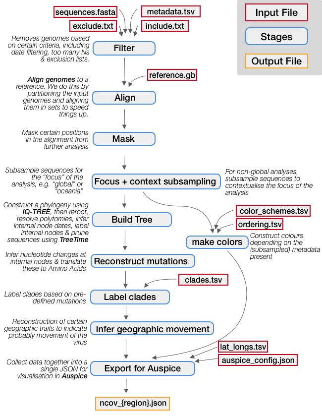

# Orientation: so, what does Nextstrain *do*, and what are all these files for?

Nextstrain has two main parts:
* **Augur** performs the bioinformatic analysis required to produce a tree, map, and other inferences from your input data.  
* The outputs of augur form the input for **Auspice**, which provides the visualizations you see on Nextstrain.org  

You can find more information about how these tools fit together [here](XXX). We'll come back to Auspice when we get to the [visualization](XXX) section.

First, let's take a look at how augur works and what all these files are.

## How are the bioinformatic analyses managed?   

At its core, augur is a collection of python scripts, each of which handles one step in the bioinformatic analysis necessary for visualization with auspice.

As you might imagine, keeping track of the input and output files from each step individually can get very confusing, very quickly.
So, to manage all of these steps, we use a workflow manager called **snakemake**.

_Note: there are many other workflow managers out there, such as nextflow. While we fully encourage you to use whichever workflow tools you prefer, we only provide support and maintenance for snakemake._  

Snakemake is an incredibly powerful workflow manager with many complex features. For our purposes, though, we only need to understand a few things:  

* Each step in a workflow is called a "rule." The inputs, outputs, and shell commands for each step/rule are defined in a `.smk` file.    
* Each rule has a number of parameters, which are specified in a `config` file.  
* Each rule produces output which may be used by other rules; these are called "dependencies."  

Below is an illustration of each step in a standard Nextstrain analysis.
Dependencies (output files from one step that act as input to the next) are indicated by grey arrows. Input files which must be provided these are indicated with red outlines. As you can see in yellow, the output is a JSON file for visualization in auspice.

Please inspect the Snakefile to see what each rule is doing in more detail and if there are any questions please make an issue so that we can improve this page!

<!-- Not all of the rules included are essential, or may even be desirable for your analysis.
We maintain this snakefile primarily for our own analyses, and thus your build may be able to be made a lot simpler!
The aim of this tutorial is to walk you through the rules in the basic analysis run by Nextstrain and to give you the ability to change it to suit your needs. -->

Additionally, there are input files which must be provided (e.g. the sequence data generated above, or other files which are part of this repo); these are indicated with red outlines.
Please inspect the `Snakefile` to see what each rule is doing in more detail and if there are any questions please [make an issue](https://github.com/nextstrain/ncov/issues/new) so that we can improve this page!

## So, about those files

These fall into one of four categories:  

* Input files  
* Directories for storing output files  
* Workflow configuration files we might want to customize  
* Workflow configuration files we don't need to touch  

We'll walk through these one by one.

## Input files  

You may remember from the [data prep](data-prep.md) section that input data consists of a `fasta` file with sequences and a `tsv` file with metadata. This input data (e.g., the provided example data) lives in the `./data/` directory.

## Directories for storing output files  

When you run an analysis with Augur, it will create three kinds of files:  
* **Error messages** and other information about the run are stored in `./logs/`  
* The **raw results** (e.g., the `fasta` file with the aligned sequences and the `newick` file with the phylogenetic tree) are stored in `./results/`  
* JSON files, which are the **input for visualization with auspice**, are stored in the `./auspice/' directory  

## Workflow configuration files we might want to customize  

*

## Workflow configuration files we don't need to touch  
